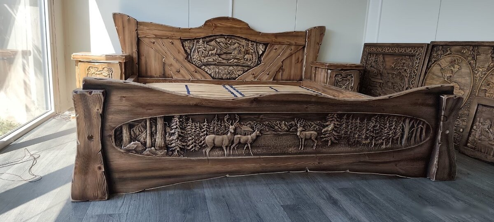

# Кровать 180×200, охотничьи мотивы



Кровать из массива, резьба на изголовье и изножье: олени в лесу. Спальное место 180×200 см. Покрытие: восковая пропитка и водный лак. Тумбочки продаются отдельно, 350 € за штуку. Доставку организуем по договорённости.

- Оригинал на Bazoš: [№ 194339015](https://nabytok.bazos.sk/inzerat/194339015/akciadrevena-postel180200-polovnicke-motivy.php)
- Цена: 1 800 €, для bazar.cz 43 900 Kč
- Фото: 18 шт. в папке [`foto/`](foto/), уже по порядку, первое будет главным

## bazar.sk · словацкий

**Заголовок**

```text
Vyrezávaná drevená posteľ 180x200 – poľovnícke motívy
```

**Текст**

```text
Drevená posteľ vyrezávaná do masívneho dreva.
Čelo pri hlave aj pri nohách zdobia vyrezávané poľovnícke motívy – jelene v lesnej krajine.

- Rozmer ložnej plochy: 180 x 200 cm
- Povrchová úprava: vosková impregnácia a vodný lak
- Nočné stolíky sa predávajú samostatne: 350 € / ks
- Dovoz po dohode zabezpečím
- Lokalita: Galanta
```

| Поле | Что указать |
|---|---|
| Kategória | Nábytok › Postele a matrace › Manželské |
| Cena | 1800 |
| Lokalita | Galanta |

## willhaben.at · немецкий

**Заголовок**

```text
Geschnitztes Massivholzbett 180x200 mit Jagdmotiven
```

**Текст**

```text
Holzbett, in Massivholz geschnitzt.
Kopf- und Fußteil sind mit geschnitzten Jagdmotiven verziert: Hirsche in der Waldlandschaft.

- Liegefläche: 180 x 200 cm
- Oberfläche: Wachsimprägnierung und Wasserlack
- Passende Nachtkästchen separat erhältlich: 350 € pro Stück
- Lieferung nach Vereinbarung, auch nach Österreich
- Standort: Galanta (Slowakei), ca. 50 km östlich von Bratislava
```

| Поле | Что указать |
|---|---|
| Kategorie | Wohnen / Haushalt / Gastronomie › Schlafzimmer › Betten |
| Preis | 1800 |
| Zustand | Neu |
| Standort | Slowakei, Galanta |
| PayLivery | aus (nur innerhalb Österreichs) |

## bazar.cz · чешский

**Заголовок** (до 100 знаков, здесь 53)

```text
Vyřezávaná dřevěná postel 180x200 – myslivecké motivy
```

**Текст**

```text
Dřevěná postel vyřezávaná do masivního dřeva.
Čelo u hlavy i u nohou zdobí vyřezávané myslivecké motivy – jeleni v lesní krajině.

- Rozměr lůžka: 180 x 200 cm
- Povrchová úprava: vosková impregnace a vodou ředitelný lak
- Noční stolky prodávám samostatně: 8 600 Kč (350 €) / ks
- Zboží se nachází v Galantě (Slovensko), dovoz do ČR po domluvě zajistím
- Cena: 43 900 Kč (1 800 €)
```

| Поле | Что указать |
|---|---|
| Kategorie | Nábytek › Ložnice › Postele |
| Cena | 43900 |
| PSČ/Město | Břeclav |
| Stav věci | Nové |
| Předání zboží | Neurčeno |
| Platba | Neurčeno |

## aukro.sk · словацкий

**Заголовок** (до 70 знаков, здесь 53)

```text
Vyrezávaná drevená posteľ 180x200 – poľovnícke motívy
```

**Текст**

```text
Drevená posteľ vyrezávaná do masívneho dreva.
Čelo pri hlave aj pri nohách zdobia vyrezávané poľovnícke motívy – jelene v lesnej krajine.

- Rozmer ložnej plochy: 180 x 200 cm
- Povrchová úprava: vosková impregnácia a vodný lak
- Nočné stolíky sa predávajú samostatne: 350 € / ks
- Dovoz po dohode zabezpečím
- Lokalita: Galanta
```

| Поле | Что указать |
|---|---|
| Kategória | Dom a záhrada › Nábytok › Spálňa › Postele › Manželské postele |
| Formát | Kúp teraz, množstvo 1, 30 dní |
| Cena | 1800 |
| Stav tovaru | Nové |
| Doprava | osobný odber + dovoz po dohode |
| Poplatok pri predaji | ≈ 153,00 € (8,5 %) |
