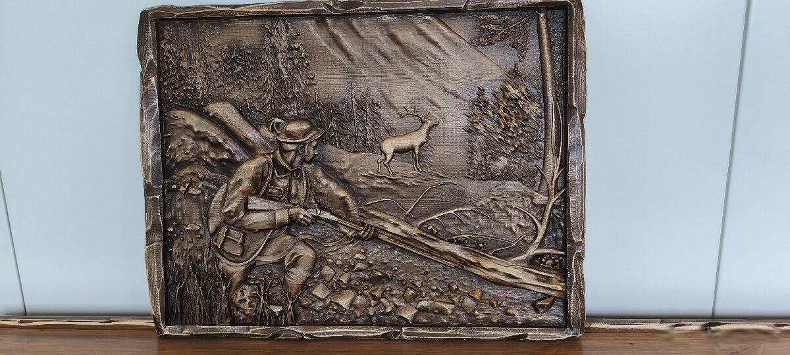

# Картина «Охотник и олень», 50×66



Резная картина из массива: охотник с ружьём и олень в лесу. 50×66 см. Покрытие: восковое масло. Отправка наложенным платежом или курьером.

- Оригинал на Bazoš: [№ 194869758](https://ostatne.bazos.sk/inzerat/194869758/dreveny-obraz-polovnicke-motivy-5066cm.php)
- Цена: 195 €, для bazar.cz 4 800 Kč
- Фото: 3 шт. в папке [`foto/`](foto/), уже по порядку, первое будет главным

## bazar.sk · словацкий

**Заголовок**

```text
Vyrezávaný drevený obraz 50x66 cm – poľovnícky motív
```

**Текст**

```text
Drevený obraz vyrezávaný do masívneho dreva.
Motív: poľovník s puškou a jeleň v lese.

- Rozmer: 50 x 66 cm
- Povrchová úprava: voskový olej
- Pošlem na dobierku alebo kuriérom
- Lokalita: Galanta
```

| Поле | Что указать |
|---|---|
| Kategória | Starožitnosti › Obrazy (alternatíva: Nábytok › Bytové doplnky) |
| Cena | 195 |
| Lokalita | Galanta |

## willhaben.at · немецкий

**Заголовок**

```text
Geschnitztes Holzbild 50x66 cm – Jäger mit Hirsch
```

**Текст**

```text
Holzbild, in Massivholz geschnitzt.
Motiv: Jäger mit Gewehr und Hirsch im Wald.

- Maße: 50 x 66 cm
- Oberfläche: Wachsöl
- Versand per Kurier, auch nach Österreich (Versandkosten nach Vereinbarung)
- Standort: Galanta (Slowakei)
```

| Поле | Что указать |
|---|---|
| Kategorie | Wohnen / Haushalt / Gastronomie › Dekoration › Bilder / Bilderrahmen › Bilder |
| Preis | 195 |
| Zustand | Neu |
| Standort | Slowakei, Galanta |
| PayLivery | aus (nur innerhalb Österreichs) |

## bazar.cz · чешский

**Заголовок** (до 100 знаков, здесь 52)

```text
Vyřezávaný dřevěný obraz 50x66 cm – myslivecký motiv
```

**Текст**

```text
Dřevěný obraz vyřezávaný do masivního dřeva.
Motiv: myslivec s puškou a jelen v lese.

- Rozměr: 50 x 66 cm
- Povrchová úprava: voskový olej
- Pošlu na dobírku nebo kurýrem, odesílám ze Slovenska (Galanta)
- Cena: 4 800 Kč (195 €)
```

| Поле | Что указать |
|---|---|
| Kategorie | Sběratelství › Obrazy › Ostatní (alternativa: Nábytek › Ostatní › Dekorace) |
| Cena | 4800 |
| PSČ/Město | Břeclav |
| Stav věci | Nové |
| Předání zboží | Zaslání poštou |
| Platba | Dobírka |

## aukro.sk · словацкий

**Заголовок** (до 70 знаков, здесь 52)

```text
Vyrezávaný drevený obraz 50x66 cm – poľovnícky motív
```

**Текст**

```text
Drevený obraz vyrezávaný do masívneho dreva.
Motív: poľovník s puškou a jeleň v lese.

- Rozmer: 50 x 66 cm
- Povrchová úprava: voskový olej
- Pošlem na dobierku alebo kuriérom
- Lokalita: Galanta
```

| Поле | Что указать |
|---|---|
| Kategória | Dom a záhrada › Zariadenia pre dom a záhradu › Obrazy › Ostatné obrazy |
| Formát | Kúp teraz, množstvo 1, 30 dní |
| Cena | 195 |
| Stav tovaru | Nové |
| Doprava | kuriér + dobierka |
| Poplatok pri predaji | ≈ 14,62 € (7,5 %) |
