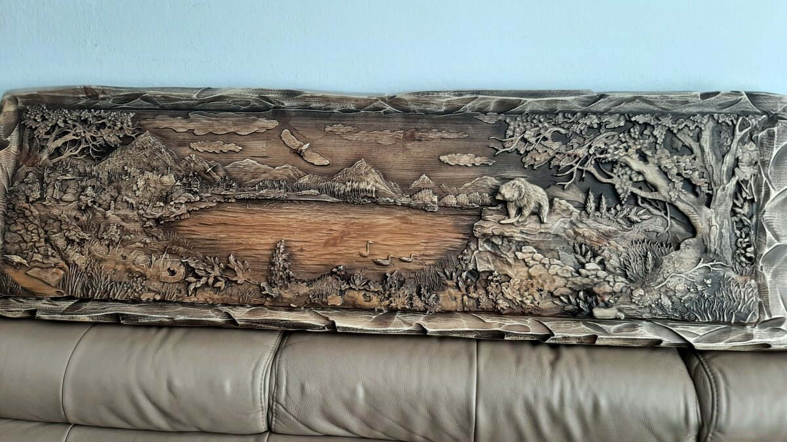

# Панорама «Горное озеро», 145×45



Большая резная картина из массива: горное озеро, медведь, лебеди и орёл. 145×45 см, толщина 4 см. Покрытие: восковая пропитка. Отправка наложенным платежом или курьером.

- Оригинал на Bazoš: [№ 194455649](https://ostatne.bazos.sk/inzerat/194455649/dreveny-obraz-14545cmhr4cm.php)
- Цена: 345 €, для bazar.cz 8 500 Kč
- Фото: 7 шт. в папке [`foto/`](foto/), уже по порядку, первое будет главным

## bazar.sk · словацкий

**Заголовок**

```text
Vyrezávaný drevený obraz 145x45 cm – horská krajina s medveďom
```

**Текст**

```text
Veľký drevený obraz vyrezávaný do masívneho dreva.
Motív: horská krajina s jazerom – medveď, labute a orol.

- Rozmer: 145 x 45 cm, hrúbka 4 cm
- Povrchová úprava: vosková impregnácia
- Pošlem na dobierku alebo kuriérom
- Lokalita: Galanta
```

| Поле | Что указать |
|---|---|
| Kategória | Starožitnosti › Obrazy (alternatíva: Nábytok › Bytové doplnky) |
| Cena | 345 |
| Lokalita | Galanta |

## willhaben.at · немецкий

**Заголовок**

```text
Geschnitztes Holzbild 145x45 cm – Bergsee mit Bär
```

**Текст**

```text
Großes Holzbild, in Massivholz geschnitzt.
Motiv: Berglandschaft mit See, Bär, Schwänen und Adler.

- Maße: 145 x 45 cm, Stärke 4 cm
- Oberfläche: Wachsimprägnierung
- Versand per Kurier, auch nach Österreich (Versandkosten nach Vereinbarung)
- Standort: Galanta (Slowakei)
```

| Поле | Что указать |
|---|---|
| Kategorie | Wohnen / Haushalt / Gastronomie › Dekoration › Bilder / Bilderrahmen › Bilder |
| Preis | 345 |
| Zustand | Neu |
| Standort | Slowakei, Galanta |
| PayLivery | aus (nur innerhalb Österreichs) |

## bazar.cz · чешский

**Заголовок** (до 100 знаков, здесь 62)

```text
Vyřezávaný dřevěný obraz 145x45 cm – horská krajina s medvědem
```

**Текст**

```text
Velký dřevěný obraz vyřezávaný do masivního dřeva.
Motiv: horská krajina s jezerem – medvěd, labutě a orel.

- Rozměr: 145 x 45 cm, tloušťka 4 cm
- Povrchová úprava: vosková impregnace
- Pošlu na dobírku nebo kurýrem, odesílám ze Slovenska (Galanta)
- Cena: 8 500 Kč (345 €)
```

| Поле | Что указать |
|---|---|
| Kategorie | Sběratelství › Obrazy › Ostatní (alternativa: Nábytek › Ostatní › Dekorace) |
| Cena | 8500 |
| PSČ/Město | Břeclav |
| Stav věci | Nové |
| Předání zboží | Zaslání poštou |
| Platba | Dobírka |

## aukro.sk · словацкий

**Заголовок** (до 70 знаков, здесь 62)

```text
Vyrezávaný drevený obraz 145x45 cm – horská krajina s medveďom
```

**Текст**

```text
Veľký drevený obraz vyrezávaný do masívneho dreva.
Motív: horská krajina s jazerom – medveď, labute a orol.

- Rozmer: 145 x 45 cm, hrúbka 4 cm
- Povrchová úprava: vosková impregnácia
- Pošlem na dobierku alebo kuriérom
- Lokalita: Galanta
```

| Поле | Что указать |
|---|---|
| Kategória | Dom a záhrada › Zariadenia pre dom a záhradu › Obrazy › Ostatné obrazy |
| Formát | Kúp teraz, množstvo 1, 30 dní |
| Cena | 345 |
| Stav tovaru | Nové |
| Doprava | kuriér + dobierka |
| Poplatok pri predaji | ≈ 25,88 € (7,5 %) |
