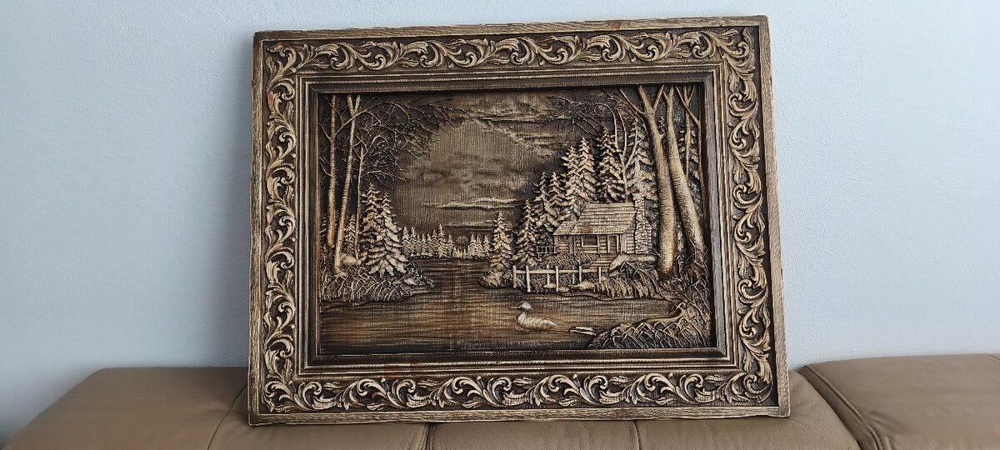

# Картина «Домик в лесу», 89×62



Резная картина из массива в резной декоративной раме: бревенчатый домик у лесного озера. 89×62 см, толщина 4 см. Покрытие: восковое масло. Отправка наложенным платежом или курьером.

- Оригинал на Bazoš: [№ 194455323](https://ostatne.bazos.sk/inzerat/194455323/dreveny-obraz-8962cmhr4cmchata-v-prirode.php)
- Цена: 280 €, для bazar.cz 6 900 Kč
- Фото: 6 шт. в папке [`foto/`](foto/), уже по порядку, первое будет главным

## bazar.sk · словацкий

**Заголовок**

```text
Vyrezávaný drevený obraz 89x62 cm – Chata v prírode
```

**Текст**

```text
Drevený obraz vyrezávaný do masívneho dreva, vo vyrezávanom ozdobnom ráme.
Motív: zrubová chata pri lesnom jazere.

- Rozmer: 89 x 62 cm, hrúbka 4 cm
- Povrchová úprava: voskový olej
- Pošlem na dobierku alebo kuriérom
- Lokalita: Galanta
```

| Поле | Что указать |
|---|---|
| Kategória | Starožitnosti › Obrazy (alternatíva: Nábytok › Bytové doplnky) |
| Cena | 280 |
| Lokalita | Galanta |

## willhaben.at · немецкий

**Заголовок**

```text
Geschnitztes Holzbild 89x62 cm – Blockhütte am See
```

**Текст**

```text
Holzbild, in Massivholz geschnitzt, mit geschnitztem Zierrahmen.
Motiv: Blockhütte an einem Waldsee.

- Maße: 89 x 62 cm, Stärke 4 cm
- Oberfläche: Wachsöl
- Versand per Kurier, auch nach Österreich (Versandkosten nach Vereinbarung)
- Standort: Galanta (Slowakei)
```

| Поле | Что указать |
|---|---|
| Kategorie | Wohnen / Haushalt / Gastronomie › Dekoration › Bilder / Bilderrahmen › Bilder |
| Preis | 280 |
| Zustand | Neu |
| Standort | Slowakei, Galanta |
| PayLivery | aus (nur innerhalb Österreichs) |

## bazar.cz · чешский

**Заголовок** (до 100 знаков, здесь 51)

```text
Vyřezávaný dřevěný obraz 89x62 cm – Chata v přírodě
```

**Текст**

```text
Dřevěný obraz vyřezávaný do masivního dřeva, ve vyřezávaném ozdobném rámu.
Motiv: srub u lesního jezera.

- Rozměr: 89 x 62 cm, tloušťka 4 cm
- Povrchová úprava: voskový olej
- Pošlu na dobírku nebo kurýrem, odesílám ze Slovenska (Galanta)
- Cena: 6 900 Kč (280 €)
```

| Поле | Что указать |
|---|---|
| Kategorie | Sběratelství › Obrazy › Ostatní (alternativa: Nábytek › Ostatní › Dekorace) |
| Cena | 6900 |
| PSČ/Město | Břeclav |
| Stav věci | Nové |
| Předání zboží | Zaslání poštou |
| Platba | Dobírka |

## aukro.sk · словацкий

**Заголовок** (до 70 знаков, здесь 51)

```text
Vyrezávaný drevený obraz 89x62 cm – Chata v prírode
```

**Текст**

```text
Drevený obraz vyrezávaný do masívneho dreva, vo vyrezávanom ozdobnom ráme.
Motív: zrubová chata pri lesnom jazere.

- Rozmer: 89 x 62 cm, hrúbka 4 cm
- Povrchová úprava: voskový olej
- Pošlem na dobierku alebo kuriérom
- Lokalita: Galanta
```

| Поле | Что указать |
|---|---|
| Kategória | Dom a záhrada › Zariadenia pre dom a záhradu › Obrazy › Ostatné obrazy |
| Formát | Kúp teraz, množstvo 1, 30 dní |
| Cena | 280 |
| Stav tovaru | Nové |
| Doprava | kuriér + dobierka |
| Poplatok pri predaji | ≈ 21,00 € (7,5 %) |
